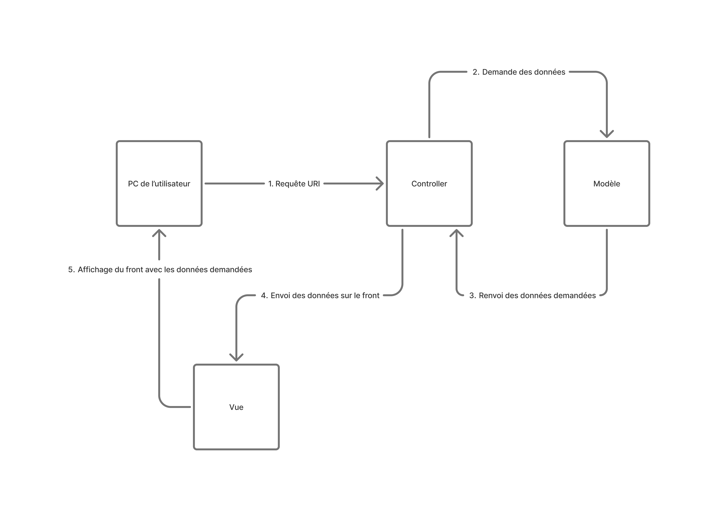
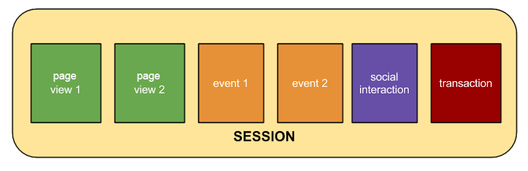

# Veille

## 1. Réaliser un schéma du pattern MVC au format svg. Indiquez les dépendances entre composants.

## 2. Qu'est-ce qu'une session dans le cadre des applications web ?
Dans le cas d'une application web, une session représente un ensemble d'interactions réalisées entre l'application et l'utilisateur sur une ou plusieurs pages en même temps au cours d'une durée prédéfinie (30 minutes par défaut ou à minuit). Si aucune interaction n’est réalisée durant la période en question, la visite se termine. Mais ne pas confondre session et visite, les sessions elles, regroupent l’ensemble des événements enregistrés depuis le début d’une visite.

> **_Sources_** \
> [AT Internet](https://www.atinternet.com/glossaire/session/#:~:text=Une%20session%20est%20une%20interaction%2C%20la%20visite%20se%20termine.) \
> [Google](https://support.google.com/analytics/answer/2731565?hl=fr#zippy=%2Cau-sommaire-de-cet-article) \
> [Microsoft](https://learn.microsoft.com/fr-fr/aspnet/core/fundamentals/app-state?view=aspnetcore-9.0) \
> [Wikipedia](https://fr.wikipedia.org/wiki/Session_(informatique)#Utilisation_des_sessions)

## 3. Le mécanisme de session ouvre une nouvelle interface d'attaque, les attaques les plus connues sont nommées _session fixation_ et _session hijacking_. Expliquez en quelques lignes et à l'aide d'un schéma (au format svg) le principe de chacune de ces attaques et comment s'en prémunir.

### Session Hijacking (Détournement de session)
**Définition :** \
Le mécanisme de session hijacking consiste pour un attaquant à voler l’identifiant de session d’un utilisateur légitime pour se faire passer pour lui sur une application web. En somme, c’est de l’usurpation d’identité où l’attaquant vole la session active de la victime. \
**Contexte :** \
Si on prenait un exemple, ça pourrait ressembler à ceci :
Un utilisateur est connecté sur un site web (par exemple, une banque en ligne). Quand il se connecte, le serveur lui attribue un identifiant de session (souvent via un cookie). Si quelqu’un parvient à intercepter cet identifiant, il peut prendre sa place sur le site sans avoir besoin de son mot de passe. \
**Techniques courantes :** \
Il existe une première technique nommée Sniffing qui permet d’écouter le réseau, l’attaquant a la possibilité d’utiliser cette technique seulement si le site n’utilise pas HTTPS. Ensuite, il existe le Cross-site scripting, autrement appelée XSS. Dans ce cas-là, l’attaquant injecte un script pour récupérer le cookie de session. Et enfin, il y a la technique Man-in-the-middle (MITM) où l’attaquant peut intercepter les données entre l’utilisateur et le serveur. \
**Voici comment s’en protéger ?** \
Toujours utiliser HTTPS dans la barre d’adresse lorsque l’on visite un site. Également, il est important d’utiliser le drapeau HttpOnly et Secure pour les cookies. En effet, d’un côté les cookies portant le flag Secure ne sont envoyés que si la requête dans la barre d’adresse commence par https. De l’autre côté, HttpOnly empêche les injections de code JS pour éviter de rendre publique l’accès aux cookies portant cette notion de HttpOnly. De plus, il est conseillé de regénérer l’ID de session après connexion et de mettre une limite de durée pour les sessions.

### Session Fixation (Fixation de session)
**Définition :** \
Le mécanisme de session fixation est une attaque qui consiste à attribuer un identifiant de session connu de l’attaquant à la victime, pour ensuite l’utiliser et accéder au compte de la victime une fois qu’elle s’y est connectée. En résumé, l’attaquant impose une session sur laquelle la victime est contrainte d’évoluer. \
**Contexte :** \
S’il on voulait mettre un contexte autour de ce type d’attaque, voilà à quoi cela pourrait ressembler :
Imaginons que l’attaquant crée une session sur un site (il reçoit un identifiant de session, ex: SID=12345). Puis envoie un lien à la victime, par exemple : https://banque.com?SID=12345. Dans le cas où le site accepte cet identifiant même après la connexion de la victime, l’attaquant pourra utiliser le même identifiant et accéder à son compte. \
**Conditions favorables :** \
Lors d’une attaque de ce type, le serveur ne régénère pas la session après connexion et l’ID de session est accepté depuis une URL ou un paramètre non sécurisé. \
**Comment s’en protéger ?** \
Tout comme pour le mécanisme de session hijacking, il est nécessaire de regénérer l’identifiant de session juste après la connexion de l’utilisateur. Il est également primordial de n’accepter les sessions que via des cookies sécurisés sans jamais permettre de définir un ID de session depuis l’URL.